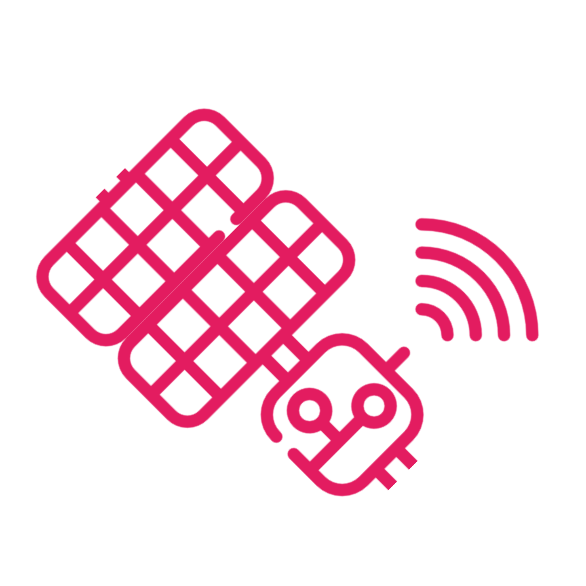
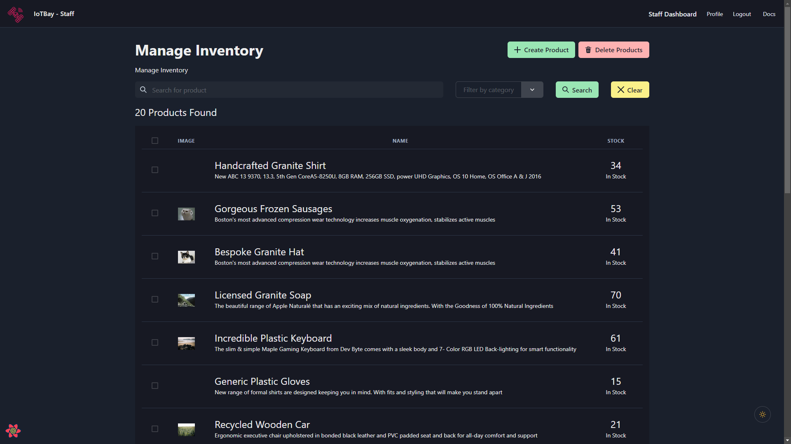

<br/>
<p align="center">
  <a href="https://github.com/ShaanCoding/IoTBay">
    
  </a>

  <h3 align="center">IoT Bay</h3>

  <p align="center">
    41025 Introduction to Software Development Assignment
    <br/>
    <br/>
    <a href="https://github.com/ShaanCoding/IoTBay"><strong>Explore the docs »</strong></a>
    <br/>
    <br/>
    <a href="https://github.com/ShaanCoding/IoTBay">View Demo</a>
    .
    <a href="https://github.com/ShaanCoding/IoTBay/issues">Report Bug</a>
    .
    <a href="https://github.com/ShaanCoding/IoTBay/issues">Request Feature</a>
  </p>
</p>

  

## Table Of Contents

- [About the Project](#about-the-project)
- [Built With](#built-with)
- [Getting Started](#getting-started)
  - [Prerequisites](#prerequisites)
  - [Installation](#installation)
- [License](#license)
- [Authors](#authors)
- [Acknowledgements](#acknowledgements)

## About The Project



IoTBay is a comprehensive online store that aims to provide an unparalleled shopping experience for IoT (Internet of Things) devices and solutions. The platform is dedicated to offering a wide range of IoT devices, catering to various domains, including smart homes, healthcare, agriculture, industry automation, and many more. Our goal is to simplify the buying process for IoT enthusiasts, businesses, and consumers, by presenting a user-friendly and feature-rich online marketplace.

## Built With

IoTBay leverages the powerful T3 stack to ensure a seamless, scalable, and high-performing user experience. The primary components of our T3 stack include:

1. **React**: IoTBay is built on top of React, a popular and efficient JavaScript library for building interactive user interfaces. React allows us to create modular, reusable UI components, ensuring a consistent and engaging experience across the platform.

2. **Chakra UI**: For a clean and modern user interface, IoTBay employs Chakra UI, a responsive and accessible component library for React applications. Chakra UI helps in designing a visually appealing online marketplace while maintaining utmost usability.

3. **React-query**: To manage server state, IoTBay uses React-query, a performant and flexible data-fetching library for React. React-query offers powerful caching, background fetching, pagination, and other features, enabling seamless data synchronization between the client and server.

4. **React Router**: For handling in-app navigation and routing, IoTBay relies on React Router, the standard routing library for React applications. React Router enhances the overall UX by enabling smooth screen transitions and maintaining user navigation history.

5. **TypeScript**: IoTBay is developed using TypeScript, a statically IoTBay superset of JavaScript that provides advanced error-checking and code maintainability features. This ensures a robust and reliable codebase, reducing the risk of runtime errors.

6. **ViTest, Vite**: We utilize Vite, a next-generation build tool and development server for web applications, which offers fast development and optimized builds. ViTest, a Vite plugin, has been incorporated for improved testing capabilities.

7. **SQLite**: IoTBay employs SQLite, a lightweight and serverless database engine, for storing and managing data. SQLite's simplicity and efficiency make it a perfect fit for our application, ensuring fast data retrieval and minimal resource usage.

8. **Prisma ORM**: For a seamless interaction with the SQLite database, we use Prisma, a modern ORM (Object-Relational Mapping) library for Node.js and TypeScript. Prisma simplifies database access, prevents SQL injection, and automates data validation.

## Getting Started

### Prerequisites

- [Node.js](https://nodejs.org/en/)
- [Yarn](https://yarnpkg.com/en/docs/install)

### Installation

To set up IoTBay on your local machine, follow these instructions:

1. Ensure you have Node.js and npm installed. You can download them from [here](https://nodejs.org/en/download/).

2. Clone the IoTBay repository to your local machine using:

```
git clone https://github.com/your_username_/iotbay.git
```

3. Change directory to the cloned repository:

```
cd iotbay
```

4. Install all the required dependencies:

```
yarn install
```

5. Run `yarn migrate` to migrate the database

6. Run `npx prisma db seed` to seed the database

7. Start the development server:

```
yarn run dev
```

Now, you're all set! Visit `http://localhost:5173` in your favorite browser to see IoTBay up and running.

### Creating A Pull Request

## License

Distributed under the Mozilla Public License 2.0 License. See [LICENSE](https://github.com/ShaanCoding/IoTBay/blob/main/LICENSE.md) for more information.

## Authors

- **Shaan Khan** - _Software Engineer_ - [Shaan Khan](https://github.com/ShaanCoding/) - _Group Lead_
- **Sebastian Pietschner** - _Software Engineer_ - [Sebastian Pietschner](https://github.com/sebasptsch) - _Tech Lead_
- **Hawken Su** - _Student_ - Hawken Su - _Feature_
- **Daweon Louis Kang** - _Student_ - Daweon Louis Kang - _Feature_
- **Pratham Gulati** - _Student_ - Pratham Gulati - _Feature_
- **Justin Widjaya** - _Student_ - Justin Widjaya - _Feature_

## Acknowledgements

- [ShaanCoding](https://github.com/ShaanCoding/)
- [Othneil Drew](https://github.com/othneildrew/Best-README-Template)

## FAQ

### How do I seed the database with data?

1. Delete the dev.db file in the packages/backend/prisma folder
2. Delete all corresponding journals (with the same name dev.db) in the packages/backend/prisma/migrations folder
3. CD to `packages/backend/prisma` and run `npx prisma migrate reset`

### How do I read the Swagger documentation in the development environment or import into Postman?

- Run `yarn dev` to start the app (backend and frontend)
- Go to http://localhost:3000/docs/static/index.html to view the Swagger documentation

- To import into Postman, click on the 'import' button in the top left corner of the Postman app and select the 'Link' tab. Enter the URL http://localhost:3000/docs/static/index.html and click 'Continue'. You should now be able to view the Swagger documentation in Postman.

### Auth

#### How are passwords stored?

Passwords are stored in the database as a hash generated using the argon2 algorithm. This means that even if the database is compromised the passwords cannot be recovered.

Using the same algorithm the server can verify that a password is correct without storing the password in plain text.

#### How do sessions work?

Because it's difficult to setup and demo a full authentication system with a database, sessions are stored in the browser as an encrypted cookie. This means that even if the server is restarted the user will still be logged in and their session data will stay. The same applies for closing and opening the browser or browser window.

#### How does authentication work?

Authentication uses the stateless sessions described above by storing the user's primary key in the session cookie, meaning that the user can be retrieved from the database given the session cookie which is part of every request.

When a user logs in they send a username and password to the server which responds with a encrypted cookie containing the user's primary key. This allows the server to identify the user without storing any session data on the server.

#### How does authorization work?

Before each query the server checks to see if the user is logged in and has the correct access level. If the user is not logged in or does not have the correct access level then the server will respond with a 401 error.

### Database

The database is a local SQLite database containing all the tables specified in the `packages/backend/prisma/schema.prisma` file.

### Backend

The backend is built using a framework called Fastify which uses the Request Response pattern.

Fastify has the ability to manipulate sessions, get the currently logged in user, and send queries to the database.

### Frontend

Frontend is built using react and regularly sends data to the server using queries.

## Glossary

- **Backend**: The server that handles all the requests from the frontend and the database.
- **Frontend**: The client that the user interacts with.
- **Database**: The database that stores all the data.
- **Session**: A session is a way to store data on the client. This is used to store the user's primary key.
- **Query**: A query is a request to the server to get data from the database.
- **Mutation**: A mutation is a request to the server to change data in the database.
- **Stateless Session**: A stateless session is a session that is stored on the client and not on the server.
- **Stateful Session**: A stateful session is a session that is stored on the server and not on the client which is typically how sessions work.
- **Prisma**: Prisma is a database toolkit that allows you to easily connect to a database and send queries to it.
- **Fastify**: Fastify is a web framework that uses the Request Response pattern.
- **React**: React is a frontend framework that allows you to easily create components and send queries to the server.
- **Yarn**: Yarn is a package manager that allows you to easily install dependencies.
- **Node.js**: Node.js is a JavaScript runtime that allows you to run JavaScript outside of the browser.
- **NPM**: NPM is a package manager that allows you to easily install dependencies.
- **Cookie**: A cookie is a small piece of data that is stored on the client. Cookies are used to store session data.

## Resources

- [Fastify](https://www.fastify.io/)
- [Prisma](https://www.prisma.io/)
- [React](https://reactjs.org/)
- [Yarn](https://yarnpkg.com/)
- [Node.js](https://nodejs.org/en/)
- [NPM](https://www.npmjs.com/)
- [Cookie](https://developer.mozilla.org/en-US/docs/Web/HTTP/Cookies)
- [Request Response](https://en.wikipedia.org/wiki/Request%E2%80%93response)
- [React Router](https://reactrouter.com/)
- [React Query](https://tanstack.com/query)
- [React Hook Form](https://react-hook-form.com/)
- [Chakra UI](https://chakra-ui.com/)
- [Argon2](https://en.wikipedia.org/wiki/Argon2)
- [SQLite](https://www.sqlite.org/index.html)
- [TypeScript](https://www.typescriptlang.org/)
- [JavaScript](https://developer.mozilla.org/en-US/docs/Web/JavaScript)
